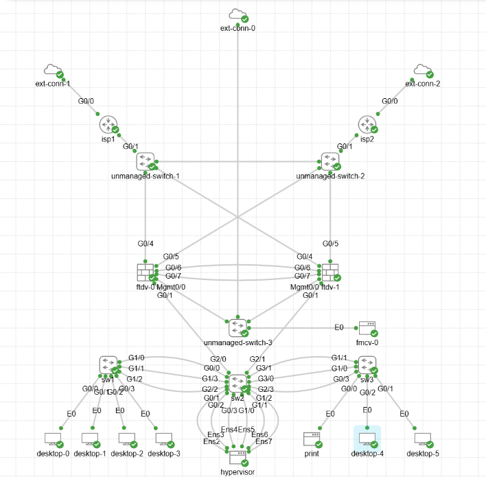

This is the topology for a LAN. I passed the CCNA exam and wanted to get my hands dirty with something that could be practical. 

The external connection to the isp routers are mostly symbolic in this lab. Connected to those are a pair of unmanaged switches, which flood frames from the internet to either of the FTD firewalls.

The FTD firewalls are deployed in a high availability pair for redundancy to go along with the redundant internet connections. Some enterprises run services that are mission critical over the internet. 

Then between the FTDs is another unmanaged switch for traffic to flow between the FMC (firepower management center) and the HA pair. There is also an external connection on the switch for the FMC to be able to access the internet and therefore access some templates cisco provides for some basic rule configuration. It goes without saying that in a production environment you would not have a direct external connection going to your management interfaces. 

On the HA pair the external interfaces have received private IPs from my home LAN in the 192.168.0.0/16 range. 

The HA interfaces exist on their own small subnets: 172.16.100.0/30 and 172.16.100.4/30.

The internal LAN is a 10.0.0.0/8 subnet. I've used 10.13.0.1/24 as the gateway on the "only" inside interface (g0/1).
 
On g0/1 from the FTDs I've configured subinterfaces for vlans I've also set up on the switches. Essentially, I've set up a router-on-a-stick. 

Between sw1, sw2 and sw3 are LACP LAGs to increase internal throughput. From sw2 to the hypervisor there are also two LACP LAGs, but they aren't functional. I've set up LAGs in the proxmox GUI, but the ubuntu CML node has proven more difficult. In any case, I have set up this functionality in my home lab with my own proxmox server and at work with esxi port groups. 

The LAGs and connections to the FTDs are trunked. Endpoints are in access mode. 

I also set up a DHCP server for some of the subinterfaces. The endpoints did pick up on the addresses per the vlan their switchport. 

Desktop-3 got 10.13.20.3 and Desktop-4 got 10.13.50.2. 3 is in the teller vlan and 4 is in the Admin/Loan vlan. 
